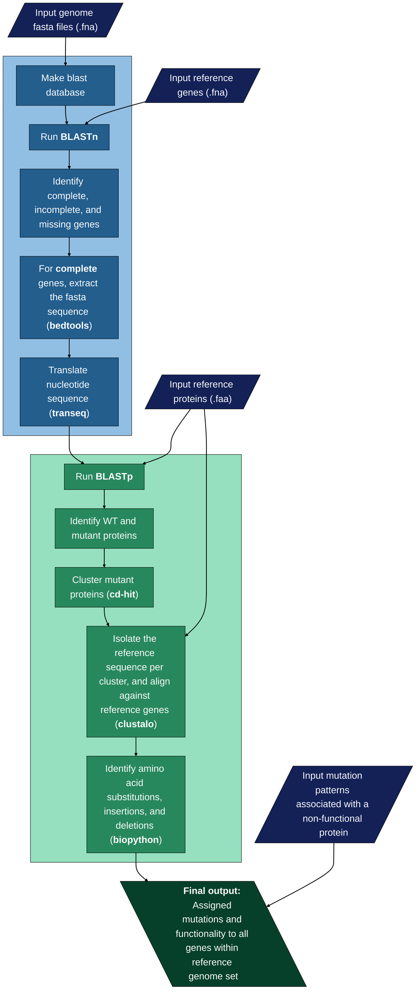

# Mutant-Calling

This Nextflow pipeline uses identified genes or regions of interest in a reference genome to identify the status of the gene or region in a set of target genome. It then aligns to the reference, and identifies amino acid substitutions, deletions, and insertions to determine the potential functionality of the gene. If enabled, the function of the gene can be assigned and the ancestral state can be determined.

## Dependencies

**Nextflow**  
Install nextflow following the instructions at https://www.nextflow.io/docs/latest/getstarted.html.

**Micromamba**
This pipeline is enabled with micromamba. Install micromamba at https://mamba.readthedocs.io/en/latest/installation/micromamba-installation.html.

All dependencies must be added to path.

## Installation
**Via github:**  
```bash 
git clone git@github.com:GaTechBrownLab/Mutant-Calling.git
```

**Via nextflow:** 
```bash 
nextflow pull GaTechBrownLab/Mutant-Calling
```

## Usage
**Inputs**
Input gene fna files must be in the output {gene}_nucl.fna, and the header must be in >{gene} format. Similarily, all input proteins must be in {gene}_prot.faa, with the header >{gene}. Host genomes must have a .fna extension. Mutation patterns must be in the [Original AA][Position][New AA] format. If the second AA is variable, write it as [Original AA][Position].

All example test inputs are stored in data, and the test host genomes are stored in a zip file that must be unzipped prior to running.

**Basic usage:**  
```bash
nextflow run main.nf -with-conda --input_genes "data/genes/*.fna" --input_prots "data/prot/*.faa" --input_muts "data/mutation_patterns/*.txt" --host_genomes "data/hosts/*.fna" --pres_abs true --graphing false
```

**Outputs**
Outputs with information on the status of each gene (functional, non-functional, or alternative function) are in the final_outputs folder. All other intermediate outputs can be found in the mutant_calling_output folder.


## Pipeline overview



