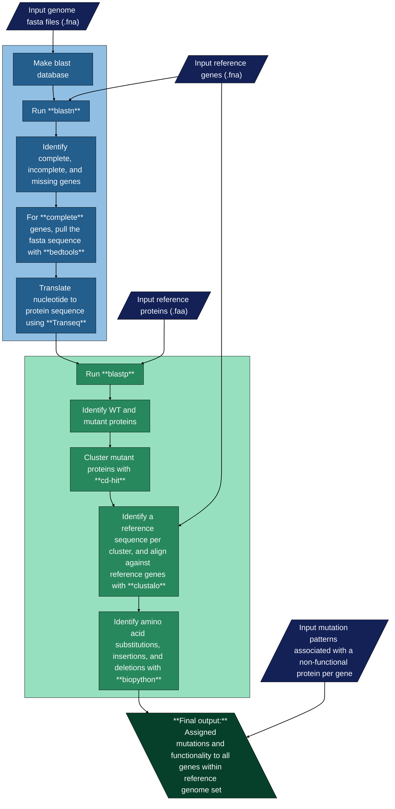

# Mutant-Calling

This Nextflow pipeline uses identified genes or regions of interest in a reference genome to identify the status of the gene or region in a set of target genome. It then aligns to the reference, and identifies amino acid substitutions, deletions, and insertions to determine the potential functionality of the gene. If enabled, the function of the gene can be assigned and the ancestral state can be determined.

## Dependencies

**Nextflow**  
Install nextflow following the instructions at https://www.nextflow.io/docs/latest/getstarted.html.

**Anaconda**
This pipeline is enabled with conda. Install conda at https://anaconda.org/.

All dependencies must be added to path.

## Installation
**Via github:**  
```bash 
git clone git@github.com:GaTechBrownLab/Mutant-Calling.git
```

**Via nextflow:** 
```bash 
nextflow pull GaTechBrownLab/Mutant-Calling
```

## Usage

**Basic usage:**  
```bash
nextflow run main.nf -with-conda --input_genes ./data/genes/*.fna --input_prots ./data/prot/*.faa
    --input_muts ./data/mutation_patterns/*.txt --host_genomes ./data/hosts/*.fna
    --outdir /results --pres_abs true --graphing false
```

## Pipeline overview



